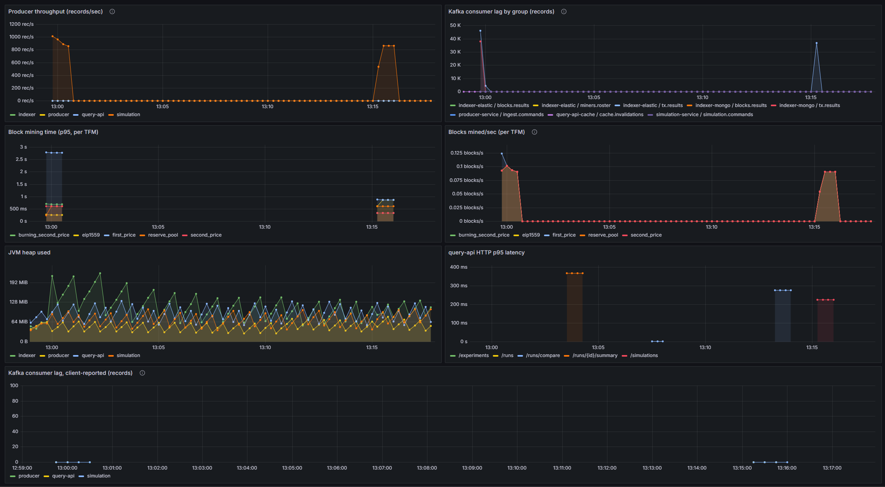

# ZBRA-TFM Simulation Platform

## Overview

The ZBRA-TFM simulation platform analyses transaction fee mechanisms (TFMs) in fee-only blockchain environments. It started as a single command-line tool for [my PhD thesis](https://eprints.lancs.ac.uk/id/eprint/236006/1/2026kruminisphd.pdf) and has since been upgraded into a Kafka streaming pipeline: it replays a transaction dataset, mines it under several fee mechanisms in parallel, stores results in Postgres, MongoDB and Elasticsearch, and serves them over a REST API for side-by-side comparison.

The core idea hasn't changed — take a set of real or synthetic transactions, decide how blocks get filled, how miners get rewarded, and how much users pay under each mechanism, and see how those choices affect the overall utility of the network.

## Features

- Five transaction fee mechanisms: first price, second price, EIP-1559, reserve pool, and a burning
  second-price auction.
- Experiments are launched over HTTP — users specify parameters such as seed, miner count, block size, base fee, arrival rate, etc.
- One dataset is mined under every requested mechanism at once, off the same Kafka topic.
- Results are queryable per run, experiment, block, or individual transaction, with a compare
  endpoint that ranks the mechanisms against each other; reproducible with the same seed and dataset.
- Datasets are read from a local file or an AWS S3 bucket.
- Runs on Docker Compose or Kubernetes, with Prometheus, Grafana and Kibana wired in for metrics.

## How it works

```
dataset (file or S3)
      |
      v
  producer  --->  Kafka  --->  simulation  --->  Kafka  --->  indexer
 (replays txs)              (mines each TFM)               (writes results)
                                    |                            |
                                    v                            v
                                Postgres                  MongoDB + Elasticsearch
                                    \___________  query-api  ___________/
                                                 (+ Redis cache)
```

- **producer** reads the dataset and replays the transactions onto a Kafka topic, pacing them into
  block cycles.
- **simulation** consumes those transactions and mines them under each requested mechanism, writing
  runs, blocks and miners to Postgres.
- **indexer** consumes the mined results and writes per-transaction documents to MongoDB and
  aggregations to Elasticsearch.
- **query-api** serves everything back over REST, with a Redis cache in front of the heavier reads.

## Requirements

- Java 21 and Maven (only needed if you build or run the services outside containers).
- Docker with the Compose plugin.
- Optional: minikube and kubectl to run on Kubernetes.
- Optional: an AWS account and an S3 bucket if you want to read datasets from S3.

## How to run it

### With Docker Compose

Two ways, depending on what you want.

Run the whole pipeline in containers:

```bash
docker compose --profile apps up --build -d
```

That starts the infrastructure (Kafka, Postgres, MongoDB, Redis, Elasticsearch, Kibana) plus the
four services and the Prometheus/Grafana stack. This is the simplest way to get everything up in one go.

Or run just the infrastructure and start the services yourself (handy while developing, so you can
run a service from your IDE or with `mvn spring-boot:run`):

```bash
docker compose up -d
```

Either way you should get:

- query-api (REST endpoints) at `http://localhost:8080`
- Grafana at `http://localhost:3000`
- Prometheus at `http://localhost:9090`
- Kibana at `http://localhost:5601`

### With Kubernetes

The same stack is described as Kubernetes manifests under `k8s/`, for running on a local minikube
cluster. Build the service images first (`docker compose --profile apps build`), then:

```bash
minikube start --memory=8192 --cpus=4 --driver=docker
minikube image load tx-analytics/producer:dev; minikube image load tx-analytics/simulation:dev; minikube image load tx-analytics/indexer:dev; minikube image load tx-analytics/query-api:dev
kubectl apply -f k8s/
kubectl get pods -n tx-analytics -w
```

In the cluster the dataset is read from S3 only, so configure the producer's credentials:

```bash
kubectl create secret generic aws-credentials -n tx-analytics \
  --from-literal=AWS_ACCESS_KEY_ID="$(aws configure get aws_access_key_id | tr -d '[:space:]')" \
  --from-literal=AWS_SECRET_ACCESS_KEY="$(aws configure get aws_secret_access_key | tr -d '[:space:]')" \
  --from-literal=AWS_REGION=eu-west-2
kubectl rollout restart deployment/producer -n tx-analytics
```

Then reach the query-api and Grafana through minikube — `kubectl port-forward -n tx-analytics svc/query-api 8080:8080` and `minikube service grafana -n tx-analytics` — and launch runs as above.

### On AWS EC2

It is also possible to run this on a single AWS EC2 instance, completely on the free tier — an `m7i-flex.large`
(2 vCPU, 8 GB) on Amazon Linux with Docker. On a box that size, layer the lean overlay
`docker-compose.ec2.yml` on top of the base file; it drops Kibana and trims the JVM heaps so the
whole pipeline fits in 8 GB.

```bash
docker compose -f docker-compose.yml -f docker-compose.ec2.yml --profile apps up --build -d
```

Grafana and the query-api are then reachable on the instance's public IP once the ports are opened.



## Input data format

Input files are JSON arrays of transaction objects. Each transaction has a hash, a fee and a size:

```json
[
  {
    "hash": "5d86d76eb840024d070508a771b1f65dbcd9a1ea5ca41830703faf7d8a83cc67",
    "fee": "0.00216065",
    "size": "225"
  },
  {
    "hash": "a417b4909a231f69fad9e4901b262965510d5aa672f3415cf6c5e61feb786a5d7",
    "fee": "0.00150000",
    "size": "300"
  }
]
```

Local datasets go in `simulation/input`. The repository includes a sample `txs-test.json` with 100k real (Bitcoin) transactions, so
a run works out of the box. A dataset is referenced by filename for a local file, or by an `s3://` URL.

## Transaction fee mechanisms

- **first_price** — the highest-bidding transactions are included and each user pays exactly what
  they bid. Simple, but users have to guess how much to bid. This is Bitcoin's original fee market
  ([Nakamoto, 2008](https://bitcoin.org/bitcoin.pdf)).

- **second_price** — the highest bidders are included, but every included transaction pays the same
  price: the lowest included bid. A uniform clearing price that takes the guesswork out of bidding
  ([Vickrey, 1961](https://doi.org/10.1111/j.1540-6261.1961.tb02789.x)).

- **eip1559** — a base fee is set per block and adjusted up or down towards a target block size. The
  base fee is burned; on top of it users add a tip, and only the tip goes to the miner. Ethereum's
  current mechanism ([Buterin et al., 2019](https://eips.ethereum.org/EIPS/eip-1559)).

- **reserve_pool** — the base fee is set as in EIP-1559, but instead of being burned the miner is
  paid an optimal amount (base fee times the target size) and the surplus goes into a shared reserve
  pool that can be drawn on later. Introduced in
  [my thesis](https://eprints.lancs.ac.uk/id/eprint/236006/1/2026kruminisphd.pdf).

- **burning_second_price** — the highest bidders are included; the top N are confirmed and the rest
  left unconfirmed. Users pay the fee of the highest unconfirmed transaction (a uniform price), the
  miner is paid the total of the unconfirmed fees, and any surplus is burned. Constructed to be
  incentive compatible ([Chung & Shi, 2021](https://arxiv.org/pdf/2111.03151)).

## Launching a run

Runs are started by sending a POST call to the query-api. The only required field is `tfms` — the set
of mechanisms to run and their parameters. Everything else falls back to a default unless specified.

```bash
curl -X POST http://localhost:8080/simulations \
  -H "Content-Type: application/json" \
  -d '{
    "label": "example",
    "dataset": "txs-test.json",
    "seed": 156915,
    "numMiners": 10,
    "tfms": {
      "first_price":  { "size_limit": "2000000" },
      "second_price": { "size_limit": "2000000" },
      "eip1559":      { "size_limit": "4000000", "target": "2000000", "base_fee": "0.0000002333" }
    }
  }'
```

It returns `202 Accepted` and the work runs asynchronously. Each mechanism becomes one "run", and the
set of runs from a single command shares one "experiment" — poll `/experiments` and `/runs` for results.

### Run parameters

`tfms` is the only required field; everything else has a default. The available mechanisms must be
given by their exact keys — not `bitcoin`, `1st_price` or anything you might assume:

`first_price`, `second_price`, `eip1559`, `reserve_pool`, `burning_second_price`.

`pacing` and `blockTime` are nested objects in the JSON; their fields are shown below with dot notation.

| Field | Type | Default | Meaning |
|-------|------|---------|---------|
| `tfms` | object | required | Mechanisms to run, keyed by the exact names above, each mapping to its own parameters (see below). |
| `dataset` | string | `txs-test.json` | Dataset to replay: a filename under `simulation/input`, or an `s3://bucket/key` URL. |
| `label` | string | none | Free-text label attached to the experiment. |
| `seed` | integer | `7653` | Seed for miner selection and transaction sampling; the same seed and dataset reproduce a run exactly. |
| `numMiners` | integer | `10` | Number of miners competing per block, chosen stake-weighted. |
| `partitions` | integer | `3` | Kafka partitions for the transaction topic; a throughput knob that rarely needs changing. |
| `pacing.meanTxPerCycle` | number | `2471.0` | Average number of transactions released per block cycle. |
| `pacing.alpha` | number | `0.02` | Dispersion of the Gamma-Poisson arrival model — how bursty arrivals are from one cycle to the next. |
| `pacing.seed` | integer | `12345` | Seed for the arrival pacing, kept separate from the simulation seed. |
| `blockTime.genesis` | string | `2023-06-01T00:00:00Z` | Timestamp of the first block (ISO-8601). |
| `blockTime.intervalSeconds` | integer | `600` | Seconds between block timestamps (600 = ten-minute blocks). |

### Mechanism parameters

Each entry in `tfms` takes its own parameters. `size_limit` is required for every mechanism; the
rest apply only to the base-fee mechanisms.

| Parameter | Applies to | Default | Meaning |
|-----------|-----------|---------|---------|
| `size_limit` | all | `2000000` (first/second/burning), `4000000` (eip1559, reserve_pool) | Maximum block size. |
| `target` | eip1559, reserve_pool | `2000000` | Target block size the base fee adjusts towards. |
| `base_fee` | eip1559, reserve_pool | `0.0000002333` | Starting base fee. |
| `reserve_base` | reserve_pool | `134.38` | Initial balance of the shared reserve pool. |
| `window` | reserve_pool | `144` | Number of blocks the base-fee adjustment smooths over. |

If you leave a mechanism's parameters as `{}`, the defaults above are used.

## Querying results

All reads are GET requests against the query-api.

| Endpoint | Returns |
|----------|---------|
| `GET /experiments` | All experiments (one per launch command). |
| `GET /experiments/{id}` | A single experiment with its runs. |
| `GET /experiments/{id}/miners` | The miner roster for an experiment. |
| `GET /runs` | All runs. Filter with `?experiment={id}` or `?tfm={name}`. |
| `GET /runs/{id}` | A single run. |
| `GET /runs/{id}/summary` | Aggregate block and fee statistics for a run. |
| `GET /runs/{id}/blocks` | The blocks mined in a run. |
| `GET /runs/{id}/miners` | Per-miner payouts for a run. |
| `GET /runs/{id}/fee-distribution` | Fee distribution (min/max/avg/percentiles). |
| `GET /runs/{id}/timeseries` | Per-block series for a run. |
| `GET /runs/compare` | Compares runs and ranks the mechanisms. Use `?experiment={id}`, `?tfm={name}`, or `?runs=id1,id2`. |
| `GET /blocks/{hash}` | A block by its hash. |
| `GET /blocks/{hash}/transactions` | The transactions in a block. |
| `GET /runs/{runId}/blocks/{height}` | A block by height within a run. |
| `GET /tx/{hash}` | Every place a transaction was included, across runs. |
| `GET /runs/{runId}/tx/{hash}` | A transaction within one run. |

A few examples.

List the runs from an experiment:

```bash
curl "http://localhost:8080/runs?experiment=1aa11bb6-0232-3180-9f45-1a2f0af429eb"
```

```json
{
  "content": [
    {
      "id": "2a5f790a-5f87-3d1d-a0a7-e48d3d62e703",
      "tfm": "first_price",
      "mechanismParams": "size_limit=2000000",
      "seed": 156915,
      "numMiners": 10,
      "datasetHash": "8df61f8189c3812e",
      "startedAt": "2026-07-23T16:18:05Z"
    }
  ],
  "totalElements": 3
}
```

Summarise one run:

```bash
curl "http://localhost:8080/runs/2a5f790a-5f87-3d1d-a0a7-e48d3d62e703/summary"
```

```json
{
  "run": { "tfm": "first_price", "mechanismParams": "size_limit=2000000" },
  "blocks": { "blockCount": 5, "avgFillRatio": 0.83 },
  "fees": { "txCount": 100000, "confirmedCount": 96120, "totalPaid": 12.84, "totalBurned": 0.0 }
}
```

Compare the mechanisms in an experiment (rankings trimmed for length):

```bash
curl "http://localhost:8080/runs/compare?experiment=1aa11bb6-0232-3180-9f45-1a2f0af429eb"
```

```json
{
  "rankings": [
    {
      "metric": "totalPaid",
      "description": "total fees paid by users",
      "higherIsBetter": false,
      "ranked": [
        { "tfm": "eip1559",      "value": 8.10,  "rank": 1 },
        { "tfm": "second_price", "value": 11.42, "rank": 2 },
        { "tfm": "first_price",  "value": 12.84, "rank": 3 }
      ]
    }
  ]
}
```

Find where a single transaction ended up:

```bash
curl "http://localhost:8080/tx/5d86d76eb840024d070508a771b1f65dbcd9a1ea5ca41830703faf7d8a83cc67"
```

```json
{
  "txHash": "5d86d76eb840024d070508a771b1f65dbcd9a1ea5ca41830703faf7d8a83cc67",
  "occurrences": [
    { "tfm": "first_price", "height": 3, "offeredFee": 0.00216065, "paidFee": 0.00216065, "confirmed": true, "burned": null }
  ]
}
```

## Extending it

The mechanism logic is separated from the core simulation. To add a new mechanism, extend
`AbstractTFM` and override how it selects valid transactions, then register it in the simulation
engine's factory. Miner selection and consensus rules live in the simulation engine and can be
changed independently of the fee mechanisms.

## License

MIT License
